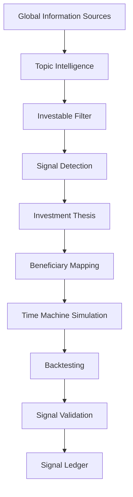
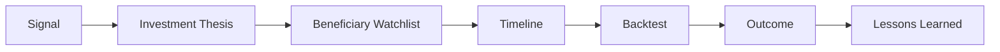

# TrendRadar Product Positioning

## Product Name

TrendRadar

## Category

AI-Powered Market Research Platform

## Slogan

Discover market signals before they become consensus.

在市場形成共識之前，發現真正值得研究的市場訊號。

## What Problem Are We Solving?

Today's investors do not lack information. They face too much information.

Every day includes:

- Global news
- Earnings calls
- Company announcements
- Supply chain updates
- Commodity and component prices
- Social discussion
- AI summaries

The hard question is not "what happened today?"

The hard question is:

- Which information is only news?
- Which information suggests a new market trend is forming?
- Which signal deserves research before it becomes consensus?

TrendRadar exists to help investors detect market signals earlier.

## What Is TrendRadar?

TrendRadar is an AI-powered market research platform.

It is not:

- A news website
- An investment advisory service
- A stock recommendation system
- A ChatGPT wrapper

TrendRadar's core job is:

Convert global information flow into verifiable market signals.

## Core Workflow

Each signal leaves a durable research record. It is not a one-time AI answer.

## What Is A Signal?

TrendRadar does not track news.

TrendRadar tracks which industries may be starting to change.

Examples:

- Memory Supercycle
- AI Power Infrastructure
- AI Cooling
- CoWoS Capacity
- Nuclear Renaissance

Each signal represents a research direction that may be forming before broad market consensus.

## What Does Each Signal Include?

Each signal should include:

1. Signal
2. Investment Thesis
3. Beneficiary Mapping
4. Timeline
5. Backtest
6. Validation
7. Lessons Learned

Example:

- Signal: Memory Price Dislocation
- Thesis: HBM demand is reallocating DRAM production capacity, creating structural memory price pressure.
- Beneficiaries: Micron, SK Hynix, Samsung, Nanya Technology, Winbond, Phison.
- Validation: 7D, 30D, 60D, and 90D return windows against a benchmark.

## How TrendRadar Is Different

Bloomberg tells users what the market is doing now.

ChatGPT helps summarize information.

News websites report what happened today.

TrendRadar answers:

- Which market signals are forming?
- Which companies may benefit?
- Did similar signals work after validation?

## The Real Product

The product is not AI.

The product is the Signal Ledger.

Signal Ledger is a durable market signal database. Each record includes:

AI helps collect, normalize, and explain information.

The long-term value is the accumulated, reviewable, and verifiable research database.

## First Market

TrendRadar should not start by covering every industry.

Phase 1 focuses on AI Infrastructure:

- HBM
- DRAM
- NAND
- CoWoS
- Cooling
- Power
- Grid
- Networking

Reasons:

- Public information is available
- Signals can be validated
- Supply chain relationships are researchable
- Historical case studies are easier to build

## One-Sentence Summary

TrendRadar is an AI-powered market research platform that turns global information flow into verifiable market signals, helping investors discover industry trends before they become consensus and building a long-term Signal Ledger as its core research asset.

## Competitive Answer

If someone asks:

"How are you different from Bloomberg, ChatGPT, or Perplexity?"

Answer:

We are not selling AI. We are building a Signal Ledger. AI helps process information, but the real value is that every market signal keeps a complete record of its hypothesis, watchlist, timeline, validation process, final outcome, and lessons learned. Over time, TrendRadar becomes a reviewable, verifiable, and self-improving market research knowledge base.
